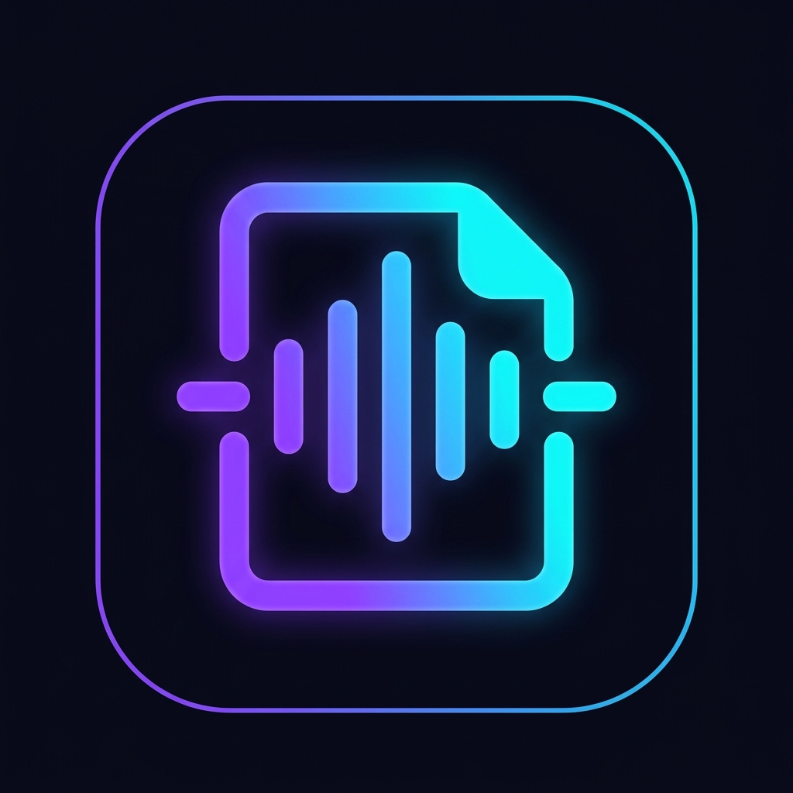

<p align="center">
  
</p>

<h1 align="center">Slide2Audio</h1>

<p align="center">
  <strong>Transform documents and presentations into premium spoken audio with AI</strong>
</p>

<p align="center">
  
  
  
  
  
</p>

---

## ✨ What is Slide2Audio?

Slide2Audio is a full-stack web application that converts PDFs, PowerPoint slides, Word documents, and plain text files into high-fidelity spoken audio using AI-powered text processing and Microsoft Edge neural text-to-speech voices.

Upload a file → choose a mode → pick a voice → get an MP3.

### Three Conversion Modes

| Mode | Description |
|------|-------------|
| **🎓 AI Lecture** | Rewrites content into a fluid, conversational lecture using an LLM before synthesizing speech |
| **🎙️ AI Podcast** | Generates a multi-voice discussion between a Host, Expert, and Student — each with a unique neural voice |
| **📄 Direct Reading** | Reads the exact extracted text verbatim with no AI modifications |

---

## 🎯 Key Features

- **Multi-format support** — `.pdf`, `.pptx`, `.docx`, `.txt`
- **6 neural voices** — US, UK, and Australian accents (male & female)
- **Multi-voice podcast mode** — Three distinct speakers with dynamic voice mapping
- **Auto-scrolling transcript** — Follows playback and highlights the active speaker turn in real-time
- **Custom glass audio player** — Vinyl disc animation, timeline scrubbing, volume control
- **Conversion history** — Local library of past conversions with instant playback
- **PWA installable** — Install as a native-like app on desktop and mobile
- **Smart LLM fallback** — Cycles through multiple free OpenRouter models with retry logic

---

## 🏗️ Architecture

```
Slide2Audio/
├── frontend/               # React 19 + Vite SPA
│   ├── public/
│   │   ├── manifest.json   # PWA manifest
│   │   ├── sw.js           # Service worker
│   │   ├── logo-*.png      # App icons (32, 64, 192, 512)
│   │   └── apple-touch-icon.png
│   ├── src/
│   │   ├── App.jsx         # Main application component
│   │   ├── App.css         # Full design system
│   │   └── main.jsx        # Entry point
│   ├── index.html          # PWA-enabled HTML with meta tags
│   └── vite.config.js      # Dev proxy to backend
│
├── backend/                # FastAPI Python API
│   ├── app/
│   │   ├── main.py         # FastAPI app + routes
│   │   ├── config.py       # Pydantic settings
│   │   ├── parse.py        # Text extraction (PDF, PPTX, DOCX, TXT)
│   │   ├── exceptions.py   # Custom error handling
│   │   ├── validators.py   # Request schemas
│   │   ├── controllers/
│   │   │   └── convert_controller.py
│   │   ├── services/
│   │   │   ├── llm_service.py     # OpenRouter LLM (free models)
│   │   │   ├── tts_service.py     # Edge TTS (single + multi-voice)
│   │   │   └── parser_service.py  # Text extraction service
│   │   └── models/
│   │       └── convert.py         # Response models
│   ├── requirements.txt
│   └── .env.example
│
└── README.md
```

---

## 🚀 Quick Start

### Prerequisites

- **Python 3.10+**
- **Node.js 18+**
- **OpenRouter API key** (free — [get one here](https://openrouter.ai/keys))

### 1. Clone the repo

```bash
git clone https://github.com/mrazindo12/Slides2Audio.git
cd Slides2Audio
```

### 2. Backend setup

```bash
cd backend

# Create virtual environment
python -m venv venv
# Windows:
venv\Scripts\activate
# macOS/Linux:
source venv/bin/activate

# Install dependencies
pip install -r requirements.txt

# Configure environment
cp .env.example .env
# Edit .env and add your OpenRouter API key:
# OPENROUTER_API_KEY=sk-or-v1-your-key-here

# Start the API server
uvicorn app.main:app --reload --port 8000
```

### 3. Frontend setup

```bash
cd frontend

# Install dependencies
npm install

# Start dev server (proxies API to :8000)
npm run dev
```

Open **http://localhost:5173** in your browser.

---

## ⚙️ Environment Variables

| Variable | Required | Description |
|----------|----------|-------------|
| `OPENROUTER_API_KEY` | Yes | Free API key from [OpenRouter](https://openrouter.ai/keys). Powers the AI Lecture and Podcast modes. |

> **Note:** Without an API key, the app still works — AI modes will fall back to reading the raw extracted text.

---

## 🤖 LLM Model Fallback Chain

The app cycles through these free OpenRouter models in order, with automatic retry on rate limits:

1. `google/gemma-4-31b-it:free`
2. `meta-llama/llama-3.3-70b-instruct:free`
3. `qwen/qwen3-next-80b-a3b-instruct:free`
4. `nousresearch/hermes-3-llama-3.1-405b:free`
5. `google/gemma-3-27b-it:free`

---

## 🎤 Voice Options

| Voice | Accent | Gender |
|-------|--------|--------|
| Aria | 🇺🇸 US | Female |
| Guy | 🇺🇸 US | Male |
| Sonia | 🇬🇧 UK | Female |
| Ryan | 🇬🇧 UK | Male |
| Natasha | 🇦🇺 AU | Female |
| William | 🇦🇺 AU | Male |

In **Podcast mode**, the selected voice becomes the Expert, and Host/Student are automatically assigned complementary voices from different accents.

---

## 📱 PWA Installation

Slide2Audio is a Progressive Web App. When visiting the site:

- **Chrome/Edge**: Click the install icon (⊕) in the address bar
- **Safari (iOS)**: Tap Share → "Add to Home Screen"
- **Android**: The browser will show an "Add to Home Screen" banner automatically

---

## 🧪 Running Tests

```bash
cd backend
pytest
```

---

## 📦 Production Build

```bash
# Build the frontend
cd frontend
npm run build
# Output is in frontend/dist/

# Serve with the backend
# Configure FastAPI to serve the static dist/ folder
# or use a reverse proxy (Nginx, Caddy, etc.)
```

---

## 🛠️ Tech Stack

| Layer | Technology |
|-------|-----------|
| Frontend | React 19, Vite 8, Lucide Icons |
| Styling | Vanilla CSS (glassmorphism, dark theme) |
| Backend | FastAPI, Pydantic v2, Uvicorn |
| Text Extraction | PyPDF2, python-pptx, python-docx |
| TTS Engine | Microsoft Edge TTS (Neural voices) |
| LLM | OpenRouter API (free-tier models) |
| PWA | Web App Manifest, Service Worker |

---

## 📄 License

MIT License — free for personal and commercial use.

---

<p align="center">
  Built with 🎧 by <a href="https://github.com/mrazindo12">mrazindo12</a>
</p>
